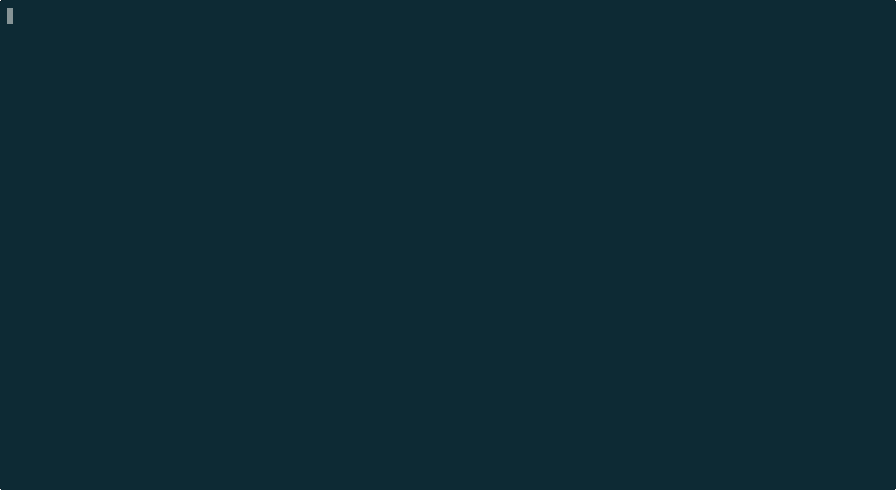

<div align="center">

[](https://github.com/neovim-idea/camelhumps-nvim/releases)
[](http://www.lua.org)
[](https://neovim.io)

## catppuccin-reloaded-nvim

###### Just your regular `catppucin/nvim` , but extensible :heart_eyes:



</div>

* [Usage](#usage)
* [Installation](#installation)
  * [Lazy](#lazy)
  * [Packer](#packer)
  * [Plug](#plug)
* [Setup](#setup)
* [Development](#development)
* [Buy me a :beer:](#buy-me-a-beer)

<!-- TOC -->


## Usage

This neovim plugin extends the catppuccin runtime, such that you can create your own catppuccin themes, leveragin its
own runtime to effortlessly apply the proper colors to many of its [available integrations](https://github.com/catppuccin/nvim/tree/main#integrations).
You'll also be able to discover them via `:colorscheme` command, with prefix `catppuccin-` :tada:

By default, this project ships with two extra themes: `catppuccin-matrix` and `catppuccin-intellijdark`.

For instructions about how to develop your custom theme, please head over the [development](#development) section.


## Installation

> [!IMPORTANT]
> The plugin requires a dependency on [cattpuccin](https://github.com/catppuccin/nvim)


### Lazy


```lua
{
  "neovim-idea/catppuccin-reloaded-nvim",
  dependencies = { "catppuccin/nvim" },
  priority = 1000,
}
```

### Packer

```lua
use {
  "neovim-idea/catppuccin-reloaded-nvim",
  requires = { "catppuccin/nvim" },
}
```

### Plug

```lua
Plug "catppuccin/nvim"
Plug "neovim-idea/catppuccin-reloadednvim"
```

## Setup

The plugin has to be configured as follows

```lua

return {
  "neovim-idea/catppuccin-reloaded-nvim",
  dependencies = { "catppuccin/nvim" },
  priority = 1000,
  config = function()
    require("catppuccin-reloaded").setup({
      -- here you can insert your usual catppuccin options
      catppuccin = {}
    })
  end,
}

```


## Development

Suppose you'd like to create your own `matrix-reloaded` theme:

1. identify the `paths` that neovim is using, and choose where you'd like to develop your plugin (let's pick, for sake
   of simplicity, `~.config/nvim/`)
2. create a subfolder `lua/catppuccin/palettes/`, with a file called `matrixreloaded.lua` (NO spaces, NOR hyphenations)
3. copy paste the content from an existing palette, i.e [frappe](https://github.com/catppuccin/nvim/blob/main/lua/catppuccin/palettes/frappe.lua), to have an easy start, and change the colors as you deem fit
4. create a subfolder `lua/lualine/themes/`, with a file called `catppuccin-matrixreloaded.lua`, with following content
   ```lua
   return require "catppuccin.utils.lualine" "frappe"
   ```
   this will make sure that your new custom theme will be used by [lualine](https://github.com/nvim-lualine/lualine.nvim) (and even if you don't let's be nice and
   provide it anyways)
5. create a subfolder `ua/barbecue/theme/`, with a file called `catppuccin-matrixreloaded.lua`, with following content
   ```lua
   return require "catppuccin.utils.barbecue" "frappe"
   ```
   again, this is not required if you're not using [barbecue.nvim](https://github.com/utilyre/barbecue.nvim), but it's
   nice if you're redistributing the theme and somebody is using it
6. save everyhing, type `:CatpuccinCompile` to refresh its internal cache, quit & reopen neovim just in case
7. if you type `:colorscheme catppuccin-<Tab>`, then `catppuccin-matrixreloaded` should appear :tada:"


## Buy me a :beer:

BTC `12CQ1L7qQvF3pPXhAgomnSfWaVkL19nV5F` 
